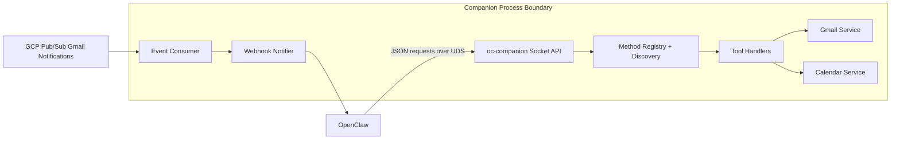

# Architecture

## Goals
- Isolate secrets and provider credentials from OpenClaw.
- Provide a narrow local API surface over Unix domain sockets.
- Enable asynchronous event delivery back to OpenClaw via webhooks.

## High-Level Components
- **OpenClaw Client**: connects to local socket and calls tools.
- **Socket API Layer**: handles protocol decoding/encoding and method dispatch.
- **Tool Handlers**: validate params and call provider-facing services.
- **Provider Integrations**: Gmail/Calendar/PubSub adapters (partially implemented).
- **Webhook Notifier**: sends event callbacks to OpenClaw (planned).

## Diagram

## Request Flow
1. OpenClaw connects to Unix socket.
2. OpenClaw calls `system.discover`.
3. OpenClaw invokes discovered method with params.
4. Socket API dispatches to matching handler.
5. Handler validates input and calls integration service.
6. Response is returned in protocol envelope.

## Event Flow (Target)
1. Pub/Sub message indicates Gmail change.
2. Consumer resolves/normalizes event payload.
3. Webhook notifier posts event to OpenClaw.
4. OpenClaw processes event and may request details via socket tool method.

## Security Boundaries
- Unix domain socket provides local-only IPC boundary.
- Separate Linux user limits process privileges.
- Credentialed provider calls stay inside `oc-companion`.
- OpenClaw receives only normalized outputs and event payloads.

## Current vs Planned
Implemented now:
- Socket server and JSON protocol.
- Discovery endpoint and method metadata.
- Initial tool method contracts.

Planned next:
- Real Gmail and Calendar API integrations.
- Pub/Sub consumer and webhook notifier.
- Hardened authz model for socket access.
